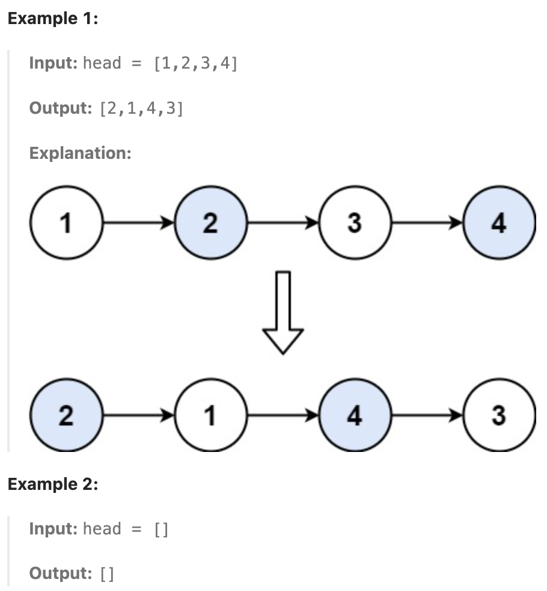

# 24. Swap Nodes in Pairs

**Problem**
Given a linked list, swap every two adjacent nodes and return its head. You must solve the problem without modifying the values in the list's nodes (i.e., only nodes themselves may be changed.)

**Example**



**My Understanding**

```text

```

**Approach (Sliding-Window)**

```text
1.
2.
3.
4.
```

**Solution Code**

```python

```

---
